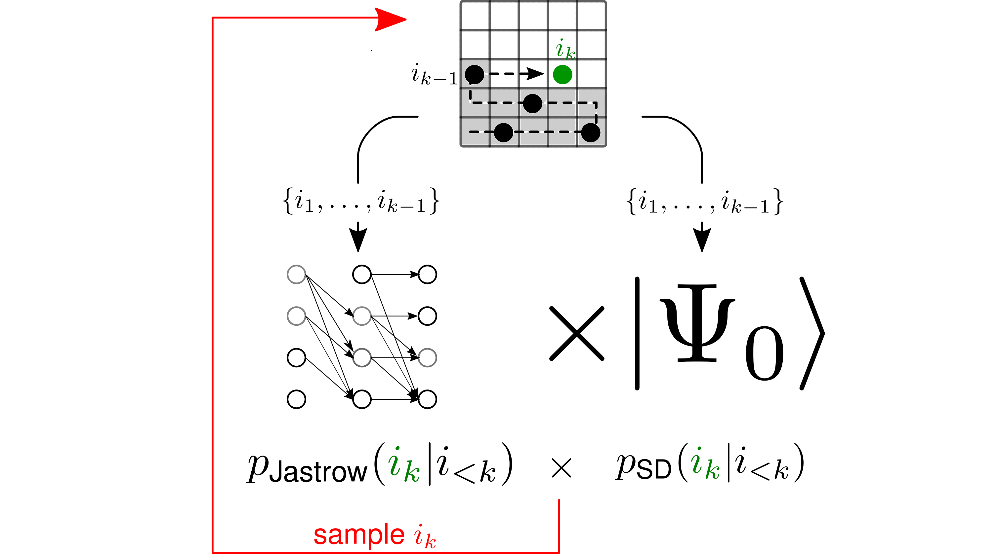

# Autoregressive Slater-Jastrow ansatz for variational Monte Carlo [arXiv:2210.05871](https://arxiv.org/abs/2210.05871) or [SciPostPhys.14.6.171](https://scipost.org/10.21468/SciPostPhys.14.6.171)

</div>

---
As a demonstration the t-V model of spinless fermions on the square lattice is implemented. 

## Key features
 - Get rid of autocorrelation time completely !
 - Fast **direct sampling** from a Slater determinant
 - Jastrow factor represented by autoregressive neural network
 - Lowrank update for local kinetic energy preserves cubic scaling 

## How to run the code
Run VMC for t-V model on a square 4x4 lattice with 8 spinless fermions and interaction strength V/t=4.0;
training iterations = 1000; batch size per iteration = 200; num. of samples in measurement phase = 300.
```python
python3 -O ./run_autoregVMC.py 4 4 8 4.0 1000 200 300 --optimizer Adam --seed 42 --optimize_orbitals True
```
For a full list of options see
```python
python3 ./run_autoregVMC.py --help
```
## Benchmarking 
```python 
python3 ./ED/ED_spinless_fermions_tV_2d.py 4 4 8 4.0
```
This requires installation of the [QuSpin](http://weinbe58.github.io/QuSpin/) library.

## Warning 
If run in debug mode (i.e. without -O flag) the lowrank update on rare occasions throws an error due 
to limited floating point precision. This could be avoided using mpmath infinite precision library.

## Cite
```
@Article{10.21468/SciPostPhys.14.6.171,
	title={{Autoregressive neural Slater-Jastrow ansatz for variational Monte Carlo simulation}},
	author={Stephan Humeniuk and Yuan Wan and Lei Wang},
	journal={SciPost Phys.},
	volume={14},
	pages={171},
	year={2023},
	publisher={SciPost},
	doi={10.21468/SciPostPhys.14.6.171},
	url={https://scipost.org/10.21468/SciPostPhys.14.6.171},
}
```
